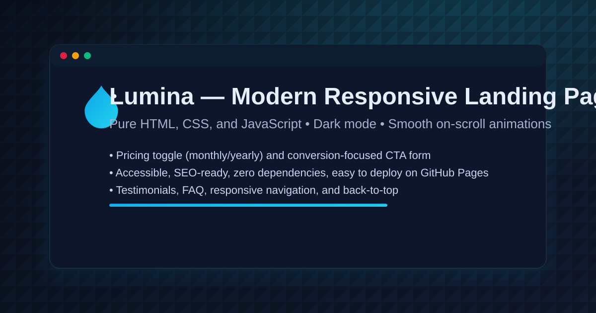

# Lumina — Landing Page Modern, Cepat, dan Responsif

Lumina adalah template landing page berkinerja tinggi untuk produk SaaS, agensi, atau proyek personal. Dibangun dengan HTML, CSS, dan JavaScript murni (tanpa dependensi), responsif, aksesibel, dan SEO‑ready — dilengkapi dark mode, animasi on‑scroll, pricing toggle, testimonial, FAQ, serta formulir CTA.

Modern responsive landing page template (HTML/CSS/JS) — fast, accessible, dark mode, on‑scroll animations, pricing, SEO‑ready.

---

## Live Demo

Akan aktif setelah GitHub Pages di-enable:

- https://samsulnusi.github.io/landing_page/

---

## Fitur Utama

- Navigasi responsif (hamburger menu)
- Hero section dengan CTA ganda dan badge kepercayaan
- Grid fitur dengan ikon
- Bagian Produk dengan pratinjau UI
- Testimonial
- Pricing dengan toggle Bulanan/Tahunan dan badge hemat 20%
- FAQ menggunakan `details/summary`
- Form CTA (validasi dasar, simpan demo ke `localStorage`)
- Tombol “Back to top”
- Dark mode toggle (preferensi disimpan di `localStorage`)
- Animasi on‑scroll menggunakan `IntersectionObserver`
- Aksesibilitas: skip-link, ARIA label, fokus jelas, dukungan prefers‑reduced‑motion
- SEO & Social: meta OG/Twitter, canonical, title, description
- OG image siap pakai: `assets/og-image.png` (dibangkitkan otomatis dari SVG via GitHub Actions)

---

## Tech Stack

- HTML5 semantik
- CSS3 (tanpa framework)
- JavaScript (tanpa library)

---

## Struktur Proyek

landing_page/
├─ index.html
├─ style.css
├─ script.js
├─ assets/
│ ├─ favicon.svg
│ ├─ logo.svg
│ ├─ hero-illustration.svg
│ └─ og-image.png
└─ .github/
└─ workflows/
└─ generate-og-image.yml

---

## Cara Menjalankan Secara Lokal

1. Clone repo ini
2. Buka file `index.html` langsung di browser (double‑click)
3. Tidak memerlukan server atau build tools

---

## Deploy ke GitHub Pages

Opsi 1 — Settings Pages (paling mudah):

- Buka `Settings` → `Pages`
- Build and deployment:
  - Source: `Deploy from a branch`
  - Branch: `main`
  - Folder: `/` landing_page
- Simpan dan tunggu 1–3 menit hingga URL aktif

Opsi 2 — GitHub Actions (opsional):

- Tambahkan workflow deploy Pages (tidak wajib, dapat menyusul)
- Workflow OG image sudah tersedia: `.github/workflows/generate-og-image.yml`

---

## Kustomisasi

- Brand: ganti teks “Lumina” di `index.html`
- Warna: ubah variabel di `:root` pada `style.css` (mis. `--brand`, `--brand-2`)
- Konten: sesuaikan copy di setiap section (Hero, Features, Product, Testimonials, Pricing, FAQ, CTA, Contact)
- Harga: edit atribut `data-monthly` dan `data-yearly` pada elemen `.price` di section Pricing
- Meta SEO & Social (index.html):
  - `og:url` dan `link rel="canonical"` → `https://samsulnusi.github.io/landing_page`
  - `og:image` dan `twitter:image` → `https://samsulnusi.github.io/landing_page/assets/og-image.png`

---

## Aksesibilitas & UX

- `scroll-margin-top` pada `.section` untuk mencegah konten tertutup header lengket saat klik anchor
- `@media (prefers-reduced-motion: reduce)` untuk meminimalkan animasi bagi pengguna sensitif motion
- Fokus keyboard yang jelas dengan `:focus-visible`
- Semua gambar memiliki `width` dan `height` agar layout stabil

---

## Otomatisasi OG Image

- Workflow `.github/workflows/generate-og-image.yml` akan membangkitkan `assets/og-image.png` (1200×630) dari `assets/og-image.svg` setiap kali push
- Cocok untuk preview saat link dibagikan (Facebook, Twitter/X)
- Debug cache sosial:
  - Facebook: https://developers.facebook.com/tools/debug/
  - Twitter/X: https://cards-dev.twitter.com/validator

---

## Kontribusi

- Issue dan PR dipersilakan
- Saran commit message: `feat`, `fix`, `docs`, `style`, `refactor`, `chore`
- Silakan fork → buat branch fitur → ajukan PR

---

---

## Cara Menjalankan Secara Lokal

1. Clone repo ini
2. Buka file `index.html` langsung di browser (double‑click)
3. Tidak memerlukan server atau build tools

---

## Deploy ke GitHub Pages

Opsi 1 — Settings Pages (paling mudah):

- Buka `Settings` → `Pages`
- Build and deployment:
  - Source: `Deploy from a branch`
  - Branch: `main`
  - Folder: `/` root
- Simpan dan tunggu 1–3 menit hingga URL aktif

Opsi 2 — GitHub Actions (opsional):

- Tambahkan workflow deploy Pages (tidak wajib, dapat menyusul)
- Workflow OG image sudah tersedia: `.github/workflows/generate-og-image.yml`

---

## Kustomisasi

- Brand: ganti teks “Lumina” di `index.html`
- Warna: ubah variabel di `:root` pada `style.css` (mis. `--brand`, `--brand-2`)
- Konten: sesuaikan copy di setiap section (Hero, Features, Product, Testimonials, Pricing, FAQ, CTA, Contact)
- Harga: edit atribut `data-monthly` dan `data-yearly` pada elemen `.price` di section Pricing
- Meta SEO & Social (index.html):
  - `og:url` dan `link rel="canonical"` → `https://samsulnusi.github.io/landing_page`
  - `og:image` dan `twitter:image` → `https://samsulnusi.github.io/landing_page/assets/og-image.png`

---

## Aksesibilitas & UX

- `scroll-margin-top` pada `.section` untuk mencegah konten tertutup header lengket saat klik anchor
- `@media (prefers-reduced-motion: reduce)` untuk meminimalkan animasi bagi pengguna sensitif motion
- Fokus keyboard yang jelas dengan `:focus-visible`
- Semua gambar memiliki `width` dan `height` agar layout stabil

---

## Otomatisasi OG Image

- Workflow `.github/workflows/generate-og-image.yml` akan membangkitkan `assets/og-image.png` (1200×630) dari `assets/og-image.svg` setiap kali push
- Cocok untuk preview saat link dibagikan (Facebook, Twitter/X)
- Debug cache sosial:
  - Facebook: https://developers.facebook.com/tools/debug/
  - Twitter/X: https://cards-dev.twitter.com/validator

---

## Kontribusi

- Issue dan PR dipersilakan
- Saran commit message: `feat`, `fix`, `docs`, `style`, `refactor`, `chore`
- Silakan fork → buat branch fitur → ajukan PR

---

## Lisensi

MIT — bebas digunakan untuk proyek personal maupun komersial. Tambahkan file `LICENSE` (MIT) di root untuk kejelasan lisensi.
